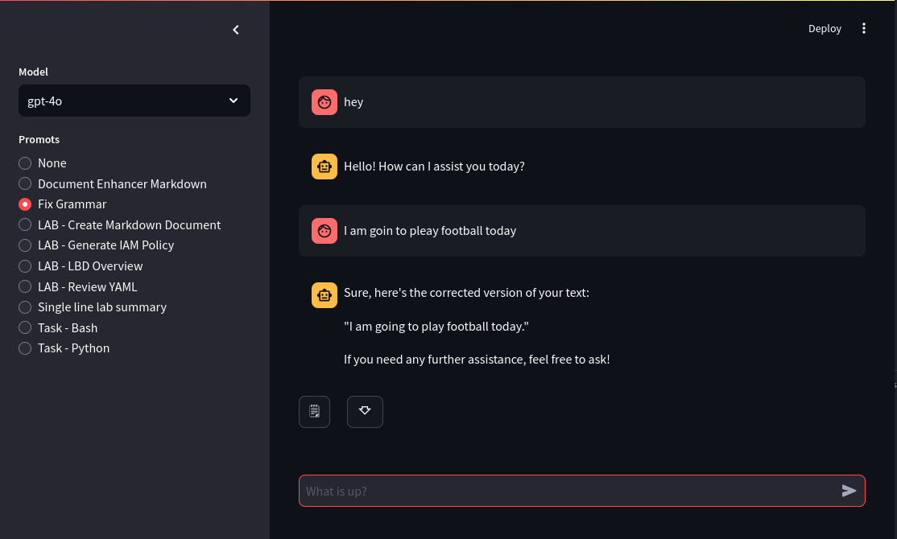

# heygpt 🔮

[](https://pepy.tech/project/heygptcli)

A simple command line tool to generate text using OpenAI GPT or Palm based on ready made templated prompts.

#### Using `heygpt` in Web-UI mode:

```bash
heygpt stream
```



## Purpose

- To provide a simple command line tool to generate text using GPT or Palm based on ready made templated prompts, in both `cli` as well as `web-ui` interface.

- [CLI demo](./.github/images/demo.gif)

- [UI demo](./.github/images/stream.png)

## Installation

- There is an optional dependency of `fzf` for interactive prompt selection. You can install it using your package manager.
- refer: [fzf README](https://github.com/junegunn/fzf#installation) for more info on steps to install `fzf`.

```bash
pip install heygptcli
```

#### help page:

```bash
heygpt --help
```

For debug logs use: `export LOG_LEVEL=DEBUG` or `set LOG_LEVEL=DEBUG` on windows.

## Configuration

You will need openai API credentials to use `heygpt`. You can get them from [here](https://beta.openai.com/).

```bash
# gpt custom prompts (optional)
GPT_PROMPT_URL=<url-to-your-prompt-file>

# openai
OPENAI_API_KEY=<your-openai-api-key>
OPENAI_ORG=<org-*****> # optional openai organization id
MODEL=gpt-4o # optional openai model name (default: gpt-3.5-turbo)


```

In order to configure them you can use `heygpt config` command:

```bash
❯ heygpt config --help

 Usage: heygpt config [OPTIONS]

 Configure heygpt.

╭─ Options -----------------------------------------------------+
│ --prompt-file         TEXT  Prompt file path.                 |
│ --prompt-url          TEXT  Prompt file url.                  |
│ --openai-key          TEXT  OpenAI API key.                   |
│ --openai-org          TEXT  OpenAI organization id.           |
| --model               TEXT  Default model name [OpenAI/Gemini]|
│ --help                      Show this message and exit.       |
----------------------------------------------------------------+
```

Default model name is `gpt-3.5-turbo` for this tool. You can change it to `gpt-4o` or any other model name you want to use.

```bash
heygpt config --openai-key <your-openai-api-key>
```

### Using local/remote prompts

Prompt YAML formate

```yaml
# ~/path/to/prompts.yaml
- Title: Fix Grammar
  Command:
    - role: user
      content: |
        Review the provided text and correct any grammatical errors. Ensure that the text is clear, concise, and free of any spelling mistakes.
```

To use your saved prompts run:

```
heygpt config --prompt-file ~/path/to/prompts.yaml
```

Here, `--prompt-url ` and `--prompt-file` is optional. If you want to use own custom
prompts.

For providing a URL of `yaml` file containing your prompts.

```bash
# remote yaml file
heygpt config --prompt-url <url-to-your-prompt-file.yaml>
```

Note: This is the default yaml used for prompts: [default-prompts.yaml](./prompts.yaml), for using your own prompts, you need to follow the same format as in this file.

For your own prompts by providing a URL to a `yaml` file containing your prompts. You can also use local `yaml` file by providing a relative path to it.

```bash
# local yaml file
heygpt config --prompt-file ~/path/to/prompts.yaml
```

```
# ~/.config/heygpt/config.json
# You can manually add list of `available_models` in config file for easy access in streamlit UI.

{
    "openai_key": "sk-proj-********",
    "model": "gpt-4o",
    "available_models": [
        "gpt-4o",
        "chatgpt-4o-latest",
        "gpt-4o-mini",
        "gpt-3.5-turbo"
    ],
    "prompt_file": "/home/user/.config/heygpt/prompt.yaml"
}
```

## Usage Examples

#### Asking `heygpt` to perform a cretain task based on prompt template:

```bash
heygpt ask
```

- `heygpt` will ask you to choose a prompt from a list of available templates.
- After that, it will ask you to enter your query/task and will provide you with the result based on type of prompt you selected.

- If you want to see output from palm instead of openai gpt, you can pass `--palm` flag to `ask` command.

```bash
heygpt ask --palm
```

- For asking queries without any prompt templates you can use `--no-prompt` flag.

```bash
heygpt ask --no-prompt
```

#### Convert audio to text using `heygpt`:

```bash
heygpt wisper ../path/to/audio.mp3
```

- You can provide standard output as well to `heygpt ask`

  ```bash
  echo "why sky is blue" | heygpt ask --no-prompt
  ```

  An other way to use it can be providing `wisper` audio 2 text, output to `heygpt ask`:

  ```bash
  heygpt wisper ../path/to/audio.mp3 | heygpt ask
  ```

This will start a `streamlit` server on `localhost`:

#### Using `heygpt` as an API:

```bash
heygpt api
```

This will start a `fastapi` server on `localhost`:
